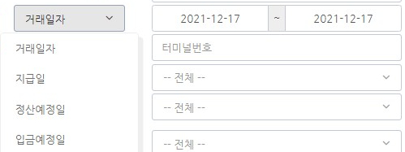

# 매입 현황 조회

* [검색 조건](undefined.md#undefined)을 입력하여 거래건별 승인내역 등 매입 현황을 조회합니다.
* 승인번호 \~ 입금상태까지 22가지 [검색 조건](undefined.md#undefined)을 입력 및 선택할 수 있습니다.
* [검색 결과](undefined.md#undefined-1)는 체크박스 \~ 리스크까지 18가지의 항목들로 구분됩니다.
* 조회 결과 항목 중 매입 번호를 통해 매입정보, 취소요청, 영수증 조회 등 [매입내역에 대한 상세 정보](undefined.md#less-than-greater-than)를 확인할 수 있습니다.
* [영수증 조회](undefined.md#less-than-greater-than-1)를 클릭하여 조회 및 VAN 매출전표를 출력할 수 있습니다.

### 검색 조건

승인번호, 매입번호, 가맹점명, (거래일자/지급일/정산예정일/입금예정일), 승인금액, 리스크, 터미널 번호, 카드BIN, 카드뒤4자리, 매입구분, 정산상태, 정산주기, 일시불/할부, 신용/체크, 매입사, 가맹점 대표자, VAN, 취소구분, 취소원거래번호, 거래번호, 가맹점 ID, 입금상태

**승인번호**\
거래 승인번호를 입력합니다.

**매입번호**\
거래 매입번호를 입력합니다.

**가맹점명**\
거래가 발생한 가맹점의 이름을 입력합니다

**(거래일자/지급일/정산예정일/입금예정일)**

조회기간을 날짜부터 날짜로 설정합니다.

**승인금액**

거래가 승인된 금액의 범위를 설정합니다.\
금액부터 금액으로 설정 가능합니다.

**리스크**

\
리스크 종류를 선택합니다.\
전체 / 건한도 / 중복 / 고액 / 최소금액 / 야간할부 / 1일중복 / 주간할부 / 야간건한도 / 위험 / 관리자설정

**터미널 번호**\
터미널 번호를 입력합니다.

**카드 BIN**\
카드의 정보를 구분할 수 있는 BIN 번호를 입력합니다.\
카드번호의 첫번째 자리부터 여섯번째 자리까지 입력합니다.

**카드뒤4자리**\
카드번호 끝 4자리를 입력합니다.

**매입구분**

\
매입에 대한 구분을 (전체 / 매입 / 매입취소) 중 선택합니다.

**정산상태**

\
정산에 대한 상태를 선택합니다.\
(전체 / 대기 / 확정 / 보류 / 완료) 중 선택합니다.

**정산주기**&#x20;

****

정산주기를 선택합니다.

.png>)

****

**일시불/할부**

\
거래가 일시불인지 할부인지를 선택합니다.

**신용/체크**

\
결제한 카드가 신용카드인지 체크카드인지를 구분합니다.

**매입사**

\
결제한 카드 매입사를 선택합니다.\
(전체, 국민, 농협, 롯데, 비씨, 삼성, 하나, 현대, 기타)

**가맹점 대표자**\
가맹점 대표자를 입력합니다.

**VAN**

       ****       \
VAN 종류를 선택합니다.

**취소구분**

\
취소구분을 선택합니다. 전체와 부분으로 구분됩니다.

**취소원거래번호**\
취소원거래번호를 입력합니다.

**거래번호**\
거래번호를 입력합니다.

**가맹점 ID**\
가맹점 ID를 입력합니다.

**입금상태**

\
입금상태를 선택합니다. (전체 / 입금대기 / 입금완료)로 구분됩니다.

### **검색 결과**

체크박스, No, 거래일시, 승인번호, 매입번호, 거래번호, 가맹점, 가맹점대표, 주문번호, 터미널ID, 매입구분, 신용/체크, 취소거래, 금액, BIN, LAST4, 할부, 리스크

**체크박스**

\
리스크를 변경하고자 하는 매입내역에 체크할 수 있습니다.

**No**

.jpeg>)\
조회된 결과의 리스트 번호를 나타냅니다.

**거래일시**

.jpeg>)\
거래가 이루어진 날짜와 시간을 나타냅니다.

**승인번호**

.jpg>)\
거래의 승인번호를 나타냅니다.

**매입번호**

\
매입번호를 나타냅니다. 클릭하면 [매입내역에 대한 상세정보](undefined.md#less-than-greater-than)를 확인할 수 있습니다. 매입 정보를 조회하고 취소를 요청할 수도 있습니다.

**거래번호**

\
거래번호를 나타냅니다.

**가맹점**

\
거래가 이루어진 가맹점을 표기합니다.

**가맹점대표**

.jpg>)\
해당 가맹점의 대표자 이름을 나타냅니다.

**주문번호**

.jpg>)\
주문 번호를 나타냅니다.

**터미널ID**

.jpeg>)\
터미널 ID를 나타냅니다.

**매입구분**

.jpeg)\
매입에 대한 구분을 나타내는데 매입과 취소로 구분됩니다.

**신용/체크**

.jpeg)\
거래한 카드가 신용카드인지 체크카드인지를 나타냅니다.

**취소거래**

\
취소 거래일 경우 취소거래번호를 나타냅니다.\
아닌 경우 공란입니다.

**금액**

\
거래 금액을 표기합니다.

**BIN**

.jpg>)\
카드의 정보를 구분할 수 있는 BIN 번호를 나타냅니다.\
카드번호의 첫번째 자리부터 여섯번째 자리까지 보여줍니다.

**LAST4**

.jpg>)\
카드번호 끝 4자리입니다.\
암호화가 되어있을 수도 있습니다.

**할부**

\
할부 기간을 나타냅니다.\
일시불 거래일 경우 00으로 표기됩니다.

**리스크**

.jpeg)\
리스크를 구분해서 나타냅니다.

### **참고**

#### <매입내역 상세정보>&#x20;

#### < 영수증 조회>&#x20;

\_LI (1).jpg>)
